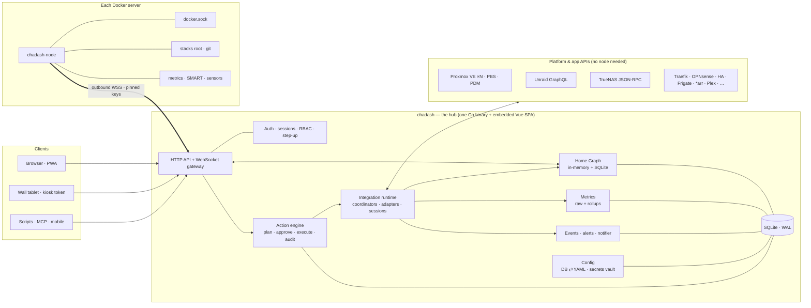

# 03 · Architecture

> This doc describes how Cha Dash is built.
> Status: **proposal**. Decided items are marked ✅. Items that still need an architecture decision record before M0 closes are marked **ADR**.

---

## Shape of the system



**Two binaries, one repo, both shipped as images and deployed with Docker Compose:**
- **`chadash`, the hub.** It holds state, the UI, integrations, actions and auth. **It never mounts a writable `docker.sock`.** That keeps it unprivileged, so a bug in the web layer can't become root on a host.
- **`chadash-node`, the thin node, one per Docker server.** This is the *only* component that changes Docker:
  - lifecycle, logs and exec
  - owned stacks
  - image updates
  - host metrics and SMART (later)
  
  It dials **out** to the hub and enforces a **local policy file**, so the hub can never exceed what the host owner allows.

**Naming note.** Proxmox also has "nodes". In the UI, Proxmox machines appear as **hosts** ("PVE host *pluto*"). "Node" always means `chadash-node`, and it gets its own glyph.

### How Docker access evolves

| Milestone | Read | Control and stacks |
|---|---|---|
| **v0.1** | The hub reads through a **read-only socket-proxy**. That's local via the sidecar in our compose file, or remote over `tcp://host:2375`, which is the setup Homepage users already have, so the importer maps it 1:1 | — |
| **v0.2** | Same | A **local node** runs next to the hub in the same compose file. It provides control and **owned stacks** on the hub's own host |
| **v0.3** | Nodes everywhere (socket-proxy remains a fallback) | **The same node binary on every Docker server**, enrolled outbound with pinned keys. Fleet-wide control and stacks |

There is one code path for Docker control (the node) from day one of control. The hub never takes on Docker write permissions.

---

## Deployment: Docker Compose first ✅

The main way to self-host Cha Dash is `docker compose up -d`. Every install doc starts here. Requirements:
- **No required environment variables.** On first boot the hub generates its vault key and prints a **setup token** to the logs.
- **One persistent volume** (`/data`).
- A **healthcheck** built into the binary, because scratch images have no curl.
- Pinned, signed, multi-arch images (amd64 and arm64; armv7 best-effort).

```yaml
# compose.yaml — Cha Dash hub (illustrative; the real file ships in deploy/ with pinned versions)
name: chadash
services:
  chadash:
    image: ghcr.io/ban-red/chadash:0.1            # GHCR under the ban-red account
    restart: unless-stopped
    ports: ["3696:3696"]                           # default port
    volumes:
      - ./data:/data                               # SQLite, vault, layout history
    environment:
      TZ: Etc/UTC
      # CHADASH_SECRET_KEY_FILE: /run/secrets/key  # optional hardening: keep the vault key outside /data
    healthcheck:
      test: ["CMD", "/chadash", "healthcheck"]

  # Optional (v0.1): lets Cha Dash *see* containers on this host. Read-only allowlist preset.
  socket-proxy:
    image: wollomatic/socket-proxy:1               # pinned in the shipped file
    restart: unless-stopped
    read_only: true
    cap_drop: [ALL]
    security_opt: ["no-new-privileges:true"]
    volumes: ["/var/run/docker.sock:/var/run/docker.sock:ro"]
    command: []                                    # shipped preset: GET-only allowlist, allowfrom=chadash

  # v0.2+: control and owned stacks on this host. Replaces socket-proxy.
  # node:
  #   image: ghcr.io/ban-red/chadash-node:0.2
  #   restart: unless-stopped
  #   volumes:
  #     - /var/run/docker.sock:/var/run/docker.sock
  #     - /opt/stacks:/opt/stacks                  # SAME path inside and out, so relative bind mounts resolve correctly
  #     - ./node:/etc/chadash-node                 # identity + local policy
  #   environment:
  #     CHADASH_HUB: ws://chadash:3696/node        # local link on the compose network
```

Adding another Docker server in v0.3 also uses compose. The hub generates this snippet for you:

```yaml
# compose.yaml — on any Docker server (generated by "Add node" in Cha Dash)
services:
  chadash-node:
    image: ghcr.io/ban-red/chadash-node:0.3
    restart: unless-stopped
    volumes:
      - /var/run/docker.sock:/var/run/docker.sock
      - /opt/stacks:/opt/stacks
      - ./chadash-node:/etc/chadash-node
    environment:
      CHADASH_HUB: wss://dash.home.arpa/node
      CHADASH_JOIN_TOKEN: cdj_…                    # single-use, expires in ~15 min
```

**Secondary channels** (each wraps the same images):
- Unraid Community Apps templates for the hub and the node (v0.1, v0.3)
- Binaries + systemd (v0.1)
- TrueNAS community app (v0.3)
- Helm and Umbrel (v1.0)
- Proxmox community-scripts LXC, once eligible

---

## The Home Graph: core data model

Every integration contributes **facts** to one graph. Widgets, ⌘K, the Atlas, alerts and actions all read from it.

```go
// Illustrative — final shapes decided in M0.

type Resource struct {
    ID        RID               // stable, namespaced: "docker:jupiter/c/4f2a…", "pve:mars/lxc/101"
    Kind      Kind              // host, vm, lxc, engine, stack, container, service, disk, pool, share,
                                // backup_job, backup_target, net_device, router, camera, ups, app, …
    Name      string
    Source    InstanceID        // which integration instance asserted this
    Labels    map[string]string // incl. discovered homepage.* / chadash.* labels
    Attrs     map[string]any    // typed per Kind via JSON Schema
    State     State             // actual: running, stopped, degraded, …
    Desired   *State            // desired: autostart/restart policy/user intent → drives "problem"
    Health    Health            // ok, attention, down, unknown, maintenance (+ reason, since)
    Links     []Link            // open URL, native-UI deep link
    Caps      []Capability      // what it can do/report: "power", "snapshot", "logs", "metrics.cpu", …
    SeenAt    time.Time         // freshness
}

type Relation struct {
    From, To RID
    Type     RelType // runs_on, part_of, exposes, routes_to, depends_on, stores_on, backed_up_by, provides_network_for, …
    Source   InstanceID
}
```

### Identity resolution: merging one thing seen by many sources

Take Sonarr on the [dogfood home](05-dogfood-home.md). It is reported by:
- the Unraid API (a dockerMan container)
- Docker (via socket-proxy or the node)
- a Traefik router (`/sonarr` path on the Unraid host's domain)
- the Sonarr integration itself
- the Homepage import

The **correlator** merges these reports using keys in priority order:

1. Exact IDs: container ID, VMID + PVE host, disk serial.
2. Network identity: host IP/port ↔ published port ↔ integration base URL ↔ Traefik router rule and upstream.
3. Names and labels: `homepage.href`, `chadash.id`, compose project/service names.
4. User confirmation, as an Inbox suggestion: "These look like the same thing. Merge?"

Merged resources keep **per-source provenance**, so you can always see which source reported what.

### Example: a slice of the dogfood home

```
pve:pluto ──runs──▶ vm:opnsense ──is──▶ router:opnsense ──provides_network_for──▶ (everything)
pve:minig5 ──runs──▶ vm:homeassistant · lxc:frigate ──exposes──▶ camera:driveway, camera:side_deck
pve:mars (2-host cluster) ──runs──▶ lxc:pvedocker ──runs──▶ engine:pvedocker ──runs──▶ container:traefik, container:uptime-kuma
unraid:jupiter ──runs──▶ engine:jupiter ──runs──▶ container:sonarr, radarr, plex, immich, pbs, …
container:pbs ──is──▶ backup_target:pbs/datastore ──stores_on──▶ array:jupiter
traefik:router/sonarr ──routes_to──▶ service:sonarr ◀──exposes── container:sonarr
app:sonarr ──depends_on──▶ app:qbittorrent, app:prowlarr
```

### What the graph enables
- **Blast radius.** A transitive walk from the action's target over `runs_on`, `part_of`, `depends_on` and `provides_network_for`, weighted by services the household uses.
  - "Reboot pluto" → **the router goes down, and with it everything**, including the user's connection to Cha Dash.
  - "Stop jupiter's array" → 24 containers stop, and PBS backups pause.
- **Root-cause hints.** When service X becomes unhealthy, look for recent state changes in its `depends_on` and `runs_on` ancestors.
- **Backup coverage.** Every resource with persistent data (VM, LXC, volume, share) is checked for an inbound `backed_up_by` edge with a recent success.
- **Zero-config context on tiles.** A tile bound to `app:sonarr` can show the health of `container:sonarr`, its host, update state and backup state without any setup.
- **Hub self-awareness.** Cha Dash knows its own `container` → `host` → `router` chain and flags any action that would take Cha Dash itself down.

---

## Integration framework

### Instances and fleets
Every integration can have **many instances**. The dogfood home has five separate Proxmox endpoints, one of which is a 2-host cluster.
- A cluster instance auto-discovers its member hosts through `/cluster/status`.
- Fleet widgets aggregate across instances, for example "6 PVE hosts across 5 clusters · 2 need attention".
- Proxmox Datacenter Manager can optionally be used as an aggregation source. It's never required.

### Capability contracts
Widgets bind to **capabilities, never to vendors**. One DNS widget serves Pi-hole, AdGuard and Technitium. One "guests" widget serves Proxmox, Unraid VMs and TrueNAS VMs.

| Capability | Examples of implementers |
|---|---|
| `containers` (list, stats, events, lifecycle, logs, exec, update) | node, socket-proxy (read), Unraid, TrueNAS apps, Podman |
| `stacks` (files, history, deploy, adopt) | node |
| `compute.guests` (power, snapshot, backup, console, migrate) | Proxmox, Unraid VMs, TrueNAS VMs |
| `storage.pools` / `storage.disks` / `storage.shares` | Unraid array, TrueNAS, PVE storage, ZFS via node |
| `backups.jobs` / `backups.snapshots` / `backups.targets` | PBS, Backrest, Kopia, Duplicati, borg-ui, Zerobyte |
| `updates` | node registry checker, Unraid, PVE apt, TrueNAS apps, WUD/Cup |
| `host.metrics` | node, Proxmox, Unraid, Glances, Beszel, Prometheus |
| `net.wan` / `net.router` / `net.devices` | OPNsense, pfSense, UniFi, Tailscale |
| `proxy.routes` | Traefik, Caddy, Nginx Proxy Manager |
| `dns.filter` | Pi-hole, AdGuard, Technitium |
| `media.sessions` / `media.library` / `media.calendar` / `media.requests` | Plex, Tautulli, Jellyfin / Sonarr, Radarr, Bazarr / Seerr |
| `downloads.queue` / `downloads.indexers` | qBittorrent, Transmission, SABnzbd / Prowlarr |
| `cameras` / `cameras.events` | Frigate |
| `home.entities` | Home Assistant |
| `checks.uptime` | built-in checks, Uptime Kuma, Gatus |
| `power.ups` | NUT, Unraid UPS |
| `primitives.*` (stat, list, table, series, status, progress) | escape hatch for anything else |

### Tier 0: built-in Go integrations

Each integration lives in its own folder and registers itself at init (the Telegraf pattern):

```
integrations/proxmox/
  manifest.yaml      # id, name, icon, version range, config JSON-Schema, capabilities, actions(+tier, scope)
  proxmox.go         # implements Integration
  client.go          # thin typed client (generated from apidoc.js); adapters per upstream major
  fixtures/          # recorded responses per upstream version (redacted)
  proxmox_test.go    # contract tests against fixtures
  README.md          # setup, least-privilege recipe, known gotchas
```

```go
// Illustrative.
type Integration interface {
    Manifest() Manifest
    Connect(ctx context.Context, cfg Config, deps Deps) (Instance, error)
}

type Instance interface {
    Test(ctx context.Context) TestResult                 // setup wizard "Test connection" + detected version
    Sync(ctx context.Context, want Interest) error       // poll only what's subscribed; emit facts
    Subscribe(ctx context.Context, emit Emitter) error   // optional push: Docker events, Unraid subs, HA WS, OPNsense SSE…
    Do(ctx context.Context, req ActionRequest) (Task, error)
    Close() error
}
```

The framework, not each integration, owns the boilerplate:
- **Coordinator** (the Home Assistant pattern):
  - One per instance.
  - Jittered intervals.
  - Polls **only what someone is watching**, and shares results across widgets.
  - Exponential backoff on transient errors.
  - **Auth errors become Repairs.** Example: "Plex rejected the token (401). Reconnect", with Plex's PIN sign-in flow.
- **HTTP client per instance:**
  - TLS policy (CA pin, trust on first use, or insecure), set per instance and never globally.
  - A **session cache**: log in once, re-authenticate on 401/403/409, log out on shutdown.
  - Rate budgets and timeouts.
  - Transparent User-Agent and Host headers.
- **Version detection** picks an adapter. When an endpoint disappears (like the Karakeep `404` on the dogfood page), the Repair says "*Karakeep's API changed (detected vX). This integration supports ≤ vY*" instead of dumping raw HTML.
- **Diagnostics:** a downloadable bundle with secrets redacted.
- **Quality tiers**, shown in the UI:
  - **Bronze:** reads basics; config schema; fixture tests.
  - **Silver:** repairs, version detection, diagnostics.
  - **Gold:** realtime where available, scoped actions, fixtures for multiple versions.
  - **Platinum:** named maintainer, full action coverage, end-to-end tests.
- **CODEOWNERS per integration.** If the owner goes away, the integration is demoted a tier, not deleted.

### Tier 1: declarative integration specs
**Internal from v0.1, public from v1.0.** Many apps are just "GET some JSON, show a few numbers, maybe POST a button". On the dogfood home that covers Mealie, Linkding, Karakeep, Bazarr and Tautulli. These should be **a YAML file and a fixture**, not a Go PR. We write our own simple integrations as specs from v0.1, which proves the format before it's frozen for the community in v1.0.

```yaml
# Illustrative spec — schema frozen at v1.0
apiVersion: chadash/v1
kind: Integration
meta: { id: mealie, name: Mealie, icon: sh:mealie, tier: core-spec }
config:
  url:   { type: url, required: true }
  token: { type: secret, required: true }
source:
  base: "{{ config.url }}"
  auth: { header: { Authorization: "Bearer {{ secret.token }}" } }
facts:
  - capability: primitives.stat
    every: 15m
    request: { method: GET, path: /api/admin/about/statistics }   # illustrative path
    extract:                      # gjson paths + expr-lang expressions (pure, terminating)
      recipes:    "totalRecipes"
      users:      "totalUsers"
      categories: "totalCategories"
```

**SSRF and safety guards:**
- Requests only go to the configured origin.
- No redirects off that origin.
- Size and time limits on responses.
- Per-spec rate limits.
- Secrets only in headers and bodies, never in URLs or logs.

Community specs install from the UI pinned to a hash. A spec can be **promoted to Tier 0** when it outgrows the format.

### Tier 2: WASM plugins (post-1.0)
- Run on wazero, with capability-gated host functions (`http` limited to configured origins, `kv`, `emit`, `log`).
- Memory and CPU limits.
- Signed and hash-pinned.

### UI extension policy (non-negotiable)
**No third-party JavaScript in the Cha Dash origin. Ever.**
- Integrations emit **data** (capabilities and primitives), and our widgets render it.
- Custom visuals, if we ever need them, go in a sandboxed opaque-origin iframe that receives data over `postMessage`.

---

## Stacks: Cha Dash owns them ✅

**Model:**
- Compose files live **on disk, on the host they run on**, under a stacks root:
  - default `/opt/stacks`, Dockge-compatible
  - on Unraid, typically `/mnt/user/appdata/chadash/stacks`
- Layout is `<root>/<stack>/compose.yaml` plus an optional `.env` for non-secret values.
- Cha Dash metadata lives **inside** the compose file under `x-chadash:`: tags, update policy, health gates, household visibility. One file, still valid compose.
- **The stacks root is a git repo**, managed by the node via go-git, so no git binary is needed. Every deploy is a commit (`deploy media · by sam via web · audit #4812`). History, diff and rollback are just git.
- Optional remote push and pull, plus pull-and-redeploy webhooks, arrive in v1.0.
- **Secrets** stay as `${secret:name}` references in files. The node resolves them **in memory at deploy time** from the hub's vault. They are never written to the repo.
- Compose runs **inside the node** through the Go Compose SDK (`docker/compose/v5/pkg/compose`). There's no docker CLI dependency.

**Deploy pipeline.** This runs as an action (tier T2), with a plan and an audit record:
1. **Validate** with compose-spec (compose-go loader) and resolve references.
2. **Plan:** diff the rendered config against what's running, using compose config-hash labels. Show which services will be recreated, pulled or removed, and the blast radius.
3. **Pull**, streaming progress.
4. **Up**, streaming progress.
5. **Health gate:** container healthchecks plus HTTP checks on exposed services.
6. **Commit**, or on failure **roll back** by checking out the previous commit, running `up` again, and reporting what failed.

**Import and adopt:**
- **Detect** running compose projects from labels (`com.docker.compose.project`, `.working_dir`, `.config_files`).
- **Adopt in place.** Register the existing path as a managed stack. The hub keeps a shadow history until you move it.
- **Move into the managed root.** Copy the files, then `down` and `up` from the new location. This keeps the **same project name**, so named volumes and networks survive. It's a T2 action with a downtime estimate.
- **From Dockge:** the layout is identical, so this is zero-copy.
- **From Portainer:** read stack files through its API or data volume.
- **Unraid stays Unraid.** Containers that Unraid's Docker UI manages stay Unraid-managed. They're controlled through the Unraid API, so Unraid's own UI keeps working. Cha Dash does not convert them to compose.

**Self-update.** On the hub's host, the local node updates the Cha Dash stack, so the hub restarts cleanly in the middle of the operation. A node updates *itself* through a short-lived helper container.

---

## Realtime

**One multiplexed WebSocket per tab** (`coder/websocket`), with an SSE fallback. Plain HTTP/1.1 on a LAN caps SSE at 6 connections per origin, shared across tabs.

```jsonc
→ {"op":"hello","v":1,"resume":4810}                       // cookie auth; Origin checked
→ {"op":"sub","id":1,"topics":["graph:lens/home","metric:host/jupiter/cpu@1m"]}
← {"op":"snap","id":1,"seq":4812,"data":{...}}              // full snapshot for the subscription
← {"op":"diff","seq":4813,"patch":[...]}                    // coalesced JSON patches, ≤ 4/s per topic
← {"op":"task","task":"t_9f2","state":"running","progress":0.4,"msg":"Pulling image…"}
← {"op":"ping"}                                             // 30s; client reconnects w/ resume seq
```

- **Inline snapshot.** `index.html` embeds the last-known graph snapshot for the current board. The page renders **instantly with real values** and then goes live. No spinners.
- **Service worker** caches the shell and the last snapshot. If the hub is unreachable, you see last-known values under a clear banner.
- **Server-side coalescing** keeps upstream noise to a few diffs per second.
- **Reverse-proxy snippets** for Traefik (first, since the dogfood home runs it), nginx, Caddy and Cloudflare Tunnel.

---

## Action engine

```go
// Illustrative.
type ActionDef struct {
    ID          string        // "docker.container.restart", "pve.guest.snapshot.rollback", "stack.deploy"
    Targets     []Kind
    Params      JSONSchema
    Tier        Tier          // T0…T4 (see 02-experience)
    Scope       string        // RBAC scope; resource-qualifiable: "docker.container.restart:host=jupiter"
    Undo        string        // optional inverse action (stop ↔ start)
    BlastRadius func(g Graph, target RID) Impact
    Async       bool          // returns Task (PVE UPIDs, TrueNAS jobs, compose deploys)
}
```

**Lifecycle:**
1. **Resolve:** target and params, validated against the schema.
2. **Authorize:** check role, scope and resource qualifiers. Require step-up auth if the tier calls for it.
3. **Plan:** steps, blast radius and diff.
4. **Approve:** the confirmation UX for the tier, or approval from another device for API- or AI-originated plans.
5. **Execute:** per-resource locks, idempotency keys, a streamed Task, and timeouts.
6. **Verify:** post-conditions, with auto-rollback where one is defined.
7. **Audit:** append-only and never optional.

```jsonc
{ "at":"2026-10-03T14:02:11Z", "actor":{"user":"sam","via":"web","session":"s_…","ip":"10.0.0.12"},
  "action":"pve.guest.reboot", "target":"pve:io/qemu/201", "params":{},
  "tier":"T2", "plan":{"impact":{"services":1}}, "result":"ok", "duration_ms":8123, "task":"UPID:…" }
```

Every surface goes through this engine: tile buttons, ⌘K, the REST API, mobile and MCP.

---

## The node (`chadash-node`)

**Enrollment** (v0.3 for remote nodes; the local node in v0.2 is paired automatically over the compose network):
1. **Mint a token.** "Add node" in Cha Dash creates a **single-use join token** valid for about 15 minutes and shows the compose snippet above.
2. **Start the node.** `docker compose up -d` on the server. The node generates an **Ed25519 keypair**, dials out over WSS, presents the token and its public key, and **pins the hub's key**.
3. **Approve.** The node appears in the Inbox as "awaiting approval". Once approved it has a long-lived identity. Keys rotate, and you can revoke or quarantine it at any time.

**Transport:**
- One persistent outbound WSS connection that multiplexes RPC, metrics, logs, exec and deploy progress.
- Optional direct mode (the hub dials the node) for air-gapped LANs.
- Mutual auth via mTLS or a Noise handshake. **ADR**.
- **No shared default certificates, ever.**

**Local policy.** The hub can't exceed it:

```yaml
# /etc/chadash-node/policy.yaml — enforced on the host; the hub cannot override it
hub:    { url: wss://dash.home.arpa/node, pin: "ed25519:8f3c…" }
docker:
  allow: [read, logs, lifecycle, update]       # not by default: exec, remove, prune
  protect: ["chadash-node", "vaultwarden"]     # never touch these
  redact_env: true                             # inspect output never leaves with secrets
stacks: { root: /opt/stacks, allow: [read, deploy, adopt] }
host:   { metrics: true, smart: false }        # smart needs CAP_SYS_RAWIO
exec:   false
relay:  { allow: [] }                          # LAN-only APIs the hub may reach through this node
```

- **Capability-scoped RPC, not a Docker API pass-through.** The node exposes verbs (`container.restart`, `stack.deploy`, `logs.tail`), each checked against the policy. Filtering a raw Docker API by path is fragile: missed endpoints and path-normalisation tricks are a recurring vulnerability class.
- **Modules:**
  - docker
  - stacks (compose SDK + go-git)
  - registry digest checker
  - logs
  - exec (off by default)
  - host metrics
  - SMART, sensors, NUT (later)
  - relay
- **Footprint target:** binary ≤ 15 MB, RSS ≤ 20 MB idle.
- **On Unraid** (optional, v0.3+): the node runs as a Community Apps container *alongside* the Unraid API. It adds what the API lacks: host metrics, per-container stats as numbers, logs, opt-in exec, SMART detail and registry update checks. Lifecycle for Unraid-managed containers still goes through the Unraid API, so Unraid stays the source of truth.

---

## Storage

**SQLite in WAL mode**, pure Go (`modernc.org/sqlite`, or `ncruces/go-sqlite3` for at-rest encryption; **ADR**). One writer plus a read pool. goose for migrations.

| Area | Contents | Retention |
|---|---|---|
| Config | Boards, layouts (versioned), integration instances, users, roles, notification rules | Forever, with history |
| Vault | Secrets, envelope-encrypted with XChaCha20-Poly1305. The key is auto-generated on first boot; `CHADASH_SECRET_KEY_FILE` moves it out of `/data` for hardening | — |
| Graph cache | Last-known resources and relations, so the page renders instantly after a restart | Current |
| Events | State changes, alerts, incidents | 90 days (configurable) |
| Audit | Action records, append-only | 1 year (configurable) |
| Metrics | Tiered rollups: raw 2h → 1m for 48h → 15m for 14d → 1h for 90d → 1d for 2y. Writes are batched | Per tier |

- **No embedded TSDB.** Cha Dash exposes `/metrics` and can read Prometheus or VictoriaMetrics as a source.
- **Self-backup:** `chadash export` writes one encrypted archive (config, vault, layouts, audit). It can run on a schedule.
- **Stack files are not in this database.** They live in git on each host (see Stacks).

---

## Config as code

- **The database is authoritative.** The GUI edits it directly.
- **YAML export and import:**
  - versioned schema
  - secrets as `${secret:…}` references
  - import shows a **visual and text diff** before applying
- **Optional git sync** (v1.0).
- **Homepage importer** (v0.1). Its acceptance test is [`testdata/importers/homepage/dogfood/`](../../testdata/importers/homepage/dogfood/README.md), a sanitized copy of the dogfood home's real config.
  - **What it maps:**
    - `services.yaml` groups → sections (column hints come from `settings.layout`); entries → tiles and checks; `widget` blocks → integration instances.
    - `docker.yaml` servers → socket-proxy endpoints. Later the Inbox suggests "replace with a node".
    - `server` + `container` pairs → explicit runs-as relations. Container names like `Plex-Current` or `binhex-qbittorrentvpn` won't match app names, so these explicit links matter.
    - `homepage.*` labels on live containers → discovery. Services defined only by labels (Immich, Mealie and PBS on the dogfood home) arrive that way.
  - **Secrets:** every plaintext credential is **moved into the vault** and replaced with a `${secret:…}` ref. The dogfood config holds 18 of them in plain YAML, which is exactly the problem this solves.
  - **Leftovers:** anything it can't map becomes an Inbox suggestion. Settings it ignores (wallpaper, colors) are listed in the import summary.

---

## Auth and security

### Identity and access
- **Local users:**
  - argon2id password hashing
  - **passkeys (WebAuthn)**
  - TOTP
  - HttpOnly, SameSite=Lax cookie sessions with CSRF tokens
- **OIDC** with PKCE (Authelia, Authentik, Pocket ID, Keycloak, Kanidm). Group claims map to roles.
- **Forward-auth headers** are opt-in, and trusted only from the `CHADASH_TRUSTED_PROXIES` CIDRs.
- **Roles:** Owner, Admin, Operator, Viewer, Household. **Scopes** can be qualified per resource. **Kiosk tokens** are bound to one board.
- **Step-up auth** (re-verify with a passkey) for T3+ actions and for viewing secrets.
- **Scoped, expiring API tokens**, each showing when it was last used.

### Hardening baseline
- **First-run takeover protection:** a setup token printed to the logs is required to create the owner account.
- **No unauthenticated network listeners**, for the hub or the node. `healthcheck` is a local subcommand.
- **Strict CSP:** `default-src 'self'`, no inline scripts, no `unsafe-eval`. Vue templates are precompiled by Vite, so only the runtime build ships. No third-party origins: fonts, icons and service logos are bundled or cached locally.
- **The hub never has Docker write access.** Only nodes do, and only within local policy.
- **Secrets never reach the browser.** Container inspect output has env vars redacted on the server or node.
- **Least-privilege onboarding.** The wizard generates exact token recipes:
  - **PVE:** `PVEAuditor` for read; `VM.PowerMgmt` and `VM.Snapshot` added for control, on a privilege-separated token. Generated per PVE instance; there are five on the dogfood home.
  - **Unraid:** the consent flow.
  - **TrueNAS:** `auth.login_ex`.
  - **Tailscale:** OAuth scopes.
- **Separate read and control credentials** wherever the upstream API supports it. Keys that are admin-equivalent are labeled that way.
- **Credential hygiene hints** go to the Inbox. They're quiet, can be dismissed, and never show the secret value:
  - **Reused secrets.** The vault compares secrets by keyed hash, so it can say "the same password is used for Traefik and qBittorrent".
  - **Credentials sent over plain `http://`.**
  - **Read-only tokens** that could be upgraded when you want control.
  - **Docker endpoints that look like a raw API instead of a filtering proxy.** Detected with a safe, read-only probe; Cha Dash never probes write endpoints.

### Threat model (summary; full version in `SECURITY.md`)

| Asset | Threat | Mitigation |
|---|---|---|
| Hub session / UI | XSS → control actions | No third-party JS, strict CSP, precompiled templates, step-up for T3+, per-action scopes, the hub holds no Docker write access |
| Stored credentials | DB file theft, backup leak | Envelope encryption, key can live outside `/data`, redacted exports and diagnostics |
| Node channel | Rogue hub or node, MITM | Pinned keypairs, single-use enrollment, admin approval, revocation, **local policy** |
| Docker socket (on nodes) | Root on host | Capability verbs, protect-list, exec off by default, env redaction |
| Stack secrets | Leak via git or disk | `${secret:}` refs resolved in memory at deploy time; never committed |
| Integration specs | SSRF into the LAN | Origin pinning, no redirects, size and time limits, no secrets in URLs |
| First run | Instance takeover | Setup token from logs |
| Forward auth | Header spoofing | Opt-in plus trusted-proxy CIDRs |
| Supply chain | Malicious dependency or release | Minimal dependencies, lockfiles, pinned versions, cosign-signed images, SBOM, OpenSSF Scorecard |

---

## Tech stack

| Layer | Choice | Why | Alternatives considered |
|---|---|---|---|
| Hub and node | **Go** (current stable); stdlib `net/http` + **huma** (OpenAPI) | A common choice for self-hosted infrastructure tools; 10–30 MB scratch images; easy arm builds; one goroutine per poller | Rust (slower builds, smaller contributor pool), Node (5–20× the footprint) |
| Docker | `github.com/moby/moby/client` with API version negotiation; **Compose SDK** (`docker/compose/v5`) in the node; **go-git** for stack history | Current SDKs; no CLI or git binary in the images | Shelling out to the docker CLI |
| Proxmox / PBS | Thin in-house client generated from `apidoc.js` | Keeps pace with 9.x privilege changes | go-proxmox |
| Expressions | gjson + expr-lang (or CEL) | Pure and always terminates | JS sandbox |
| Realtime | `coder/websocket` + SSE fallback | Maintained; avoids the HTTP/1.1 connection cap | gorilla/websocket (stale) |
| Storage | SQLite WAL (modernc or ncruces), goose, sqlc | Zero-ops | Postgres (later, maybe) |
| **Frontend** ✅ | **Vue 3.6** (RC now; move to stable at release) + **Vite** (latest), a plain SPA with no SSR or Nuxt, embedded with `go:embed`. `<script setup lang="ts">` and the Composition API | Owner's choice. Large contributor pool. Go with an embedded Vue SPA is a well-proven pairing. Vue gets Motion's layout animations, which Svelte doesn't | Svelte 5 (the earlier recommendation), React 19 |
| Vapor mode | **Opt-in per component, measured, not assumed.** Candidates: hot widget internals (rolling numerals, sparklines, grid cells) once Vapor is stable | Fine-grained updates for high-frequency data without rewriting the app | — |
| State | Pinia. The graph store is fed by WS diffs and holds large data in `shallowRef` / `markRaw` | Predictable; avoids deep reactivity on a big graph | — |
| Routing | Vue Router (history mode; sheets and lenses get real URLs) | Deep-linkable sheets | — |
| UI primitives | **Reka UI**: headless, accessible (dialog, popover, menu, combobox for ⌘K, tooltip) and styled only with our tokens | Accessibility without someone else's look | Headless UI |
| Motion | **Motion for Vue** (springs, layout animations, gestures); Vue `<Transition>` / `<TransitionGroup>` (FLIP moves); View Transitions API for expand-in-place; `prefers-reduced-motion` honored everywhere | Interruptible spring physics, which is the "Apple feel" | @vueuse/motion |
| Utilities | **VueUse**: wake lock, media queries, reduced motion, intersection, idle | Kiosk and PWA needs covered | — |
| Styling | Tailwind 4 + our token layer (OKLCH CSS variables) | Tokens are the design system | UnoCSS |
| Grid | **Our own layout engine**: a framework-agnostic TS package (packing, collision, Z-reflow, snapping to supported sizes, derived breakpoints) rendered by Vue with Motion. **ADR**: spike against gridstack 14 first | The layout engine *is* how the product feels | gridstack 14, dnd-kit/dom (pre-1.0) |
| Charts | Hand-rolled SVG/canvas sparklines and bars; uPlot for detailed time series | Tiny, fast, on-brand | ECharts (heavy) |
| API client | `openapi-typescript` + `openapi-fetch`, generated from the hub's OpenAPI | One typed source of truth | — |
| PWA | `vite-plugin-pwa` (Workbox), CSP-compatible | Offline shell, last-known snapshot, Web Push | — |
| i18n | `vue-i18n` (ICU-style messages); Weblate for community translations | Big translation communities exist | Crowdin |
| Frontend tests | Vitest + Vue Test Utils; Playwright (e2e and visual regression against the simulator); axe | — | — |
| Auth libs | go-webauthn, coreos/go-oidc, argon2id | Standard and maintained | — |
| Build and ship | goreleaser + buildx; scratch or distroless; non-root; `/data`; healthcheck subcommand; cosign; SBOM; **compose files in `deploy/`** | Catalog requirements | — |

---

## Performance budgets (enforced in CI where possible)

| Budget | Target |
|---|---|
| Hub image | ≤ 40 MB compressed |
| Hub idle RSS | ≤ 60 MB with no integrations · ≤ 120 MB with the full dogfood home (~25 integration instances, ~300 resources) |
| Node | ≤ 15 MB binary · ≤ 20 MB RSS idle |
| First meaningful paint on LAN | ≤ 300 ms, with real last-known values |
| JS bundle (initial) | ≤ 150 KB gzipped |
| Interaction | 60 fps drag and resize on a mid-range phone; input-to-feedback ≤ 50 ms |
| Upstream politeness | Poll only watched resources; per-integration rate budgets; one session per upstream |

---

## Repository layout (monorepo)

```
cmd/
  chadash/              # hub main (serve, export, import, healthcheck, dev subcommands)
  chadash-node/         # node main
internal/
  graph/  correlate/  runtime/  actions/  auth/  vault/  config/  metrics/  events/  notify/  realtime/  api/
  docker/               # shared Docker read model (used by hub via socket-proxy in v0.1, and by node)
node/                   # node modules: docker, stacks (compose SDK + go-git), registry, host, smart, relay, exec
integrations/           # Tier 0: one folder per integration (+ fixtures)
specs/                  # Tier 1: declarative specs bundled in-tree
web/                    # Vue 3.6 SPA (Vite): src/app, src/design (tokens, primitives), src/widgets
packages/layout/        # framework-agnostic TS layout engine (+ property tests)
design/                 # token source, prototypes, icon pipeline
sim/                    # Demo Home simulator, seeded from the dogfood topology
deploy/                 # compose.yaml (hub), compose.node.yaml, socket-proxy presets, Unraid templates, systemd, helm
testdata/               # cross-package fixtures, e.g. importers/homepage/dogfood (sanitized)
docs/                   # research/, plan/, adr/, user & contributor docs
```

---

## Testing and developer experience

- **Demo Home simulator (`chadash dev --sim`)**, seeded from the [dogfood topology](05-dogfood-home.md):
  - 5 PVE endpoints (one a 2-host cluster), an Unraid box, PBS in a container, a Docker LXC, OPNsense on a VM, HA and Frigate.
  - **Scripted incidents:**
    - Plex token revoked
    - Karakeep API changes
    - PBS datastore fills up
    - a backup task fails
    - a memory-pressured PVE host
    - an OOM-killed qBittorrent
  
  It powers development without hardware, the public demo, the docs, and visual regression tests.
- **Recorded-fixture contract tests:** `chadash dev record --integration sonarr --url …` captures and redacts responses for each upstream version, and CI replays them.
- **Workbench** (`/dev/workbench`): every widget × size × state × theme × level of detail, rendered from fixtures.
- **Scaffolding:** `chadash dev new integration <name>`, `chadash dev new spec <name>`.
- **Tests:**
  - unit tests (graph, correlator, layout engine, action policy, node policy)
  - property and fuzz tests (layout engine, expression evaluator, compose diffing)
  - Playwright e2e against the simulator
  - axe
  - bundle and RSS budgets
- **Security in CI:**
  - govulncheck and dependency review
  - CodeQL and secret scanning
  - a central test that **every RPC and action route is authorized**, on both the hub and the node
